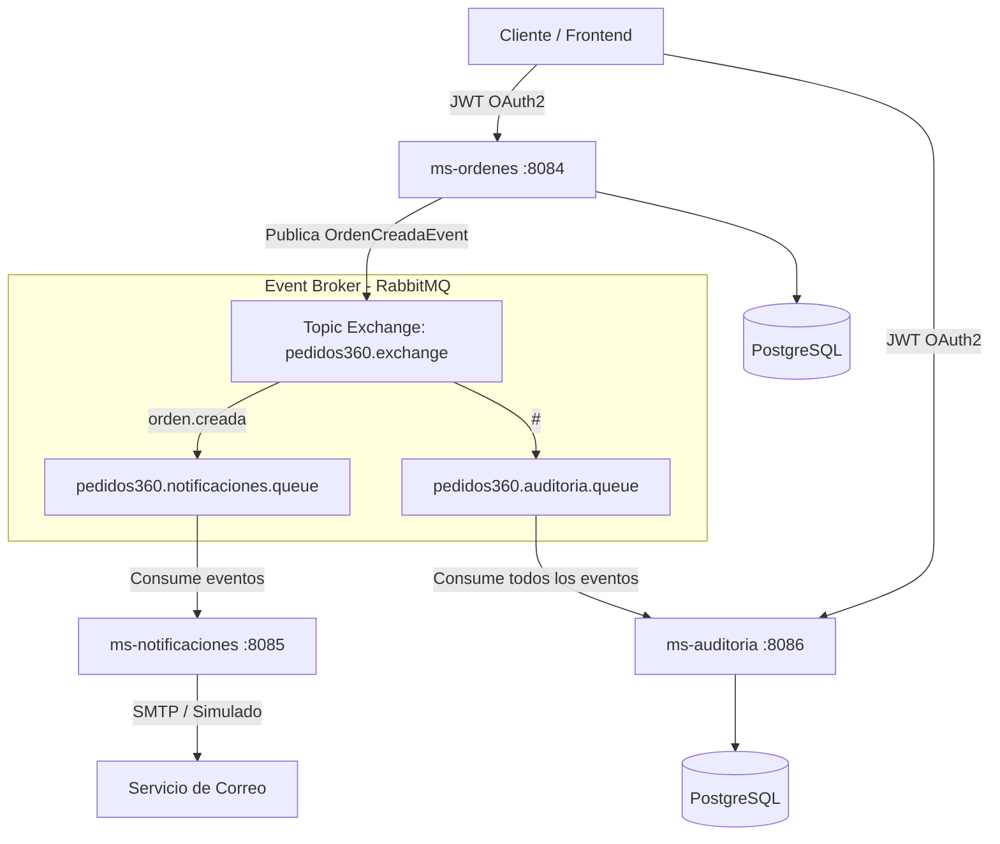

# Sistema de Microservicios Backend - Pedidos360 (Dev02)

Este repositorio contiene el ecosistema de **microservicios backend** para la plataforma de E-Commerce / Pedidos360. La arquitectura está diseñada bajo un enfoque de **microservicios orientados a eventos (Event-Driven Architecture)** construidos con **Java 17 / Spring Boot 3**, mensajería mediante **RabbitMQ**, persistencia en **PostgreSQL**, autenticación centralizada con **Azure AD (Entra ID)** y despliegue automatizado en **AWS EC2** a través de **GitHub Actions** y **AWS SSM**.

---

## 📐 Arquitectura General



---

## 🚀 Microservicios del Ecosistema

### 1. `ms-ordenes` (Puerto: `8084`)

- **Propósito**: Gestión central de órdenes de compra y carritos.
- **Funcionalidades principales**:
  - Recepción y validación de nuevas órdenes (`POST /api/v1/ordenes`).
  - Extracción de identidad del usuario autenticado mediante el Token JWT (claim `oid` o `sub` de Azure AD).
  - Persistencia de órdenes e ítems asociados en PostgreSQL.
  - Publicación de evento asíncrono `OrdenCreadaEvent` a RabbitMQ (`pedidos360.exchange` / `orden.creada`).
  - Consulta del historial de órdenes del usuario autenticado (`GET /api/v1/ordenes`).
  - Consulta detallada por ID de orden (`GET /api/v1/ordenes/{id}`).

### 2. `ms-notificaciones` (Puerto: `8085`)

- **Propósito**: Procesamiento y envío de notificaciones por correo electrónico.
- **Funcionalidades principales**:
  - Listener asíncrono en RabbitMQ (`pedidos360.notificaciones.queue`) escuchando eventos `orden.creada`.
  - Envío automático de confirmaciones de compra por correo vía SMTP (soporta Gmail / JavaMailSender).
  - Soporte para **Modo Simulado** (`notificaciones.email.modo-simulado=true`) para pruebas de desarrollo local sin envío de mails reales.
  - Endpoint REST de prueba rápida (`POST /api/v1/notificaciones/test-email`).

### 3. `ms-auditoria` (Puerto: `8086`)

- **Propósito**: Trazabilidad, auditoría y registro histórico de eventos en el sistema.
- **Funcionalidades principales**:
  - Listener comodín (`#`) en RabbitMQ que captura **todos** los eventos circulantes en el exchange `pedidos360.exchange`.
  - Persistencia del payload de cada evento, tipo de evento y fecha/hora exacta en PostgreSQL (`RegistroAuditoria`).
  - Endpoint REST de consulta de traza de auditoría (`GET /api/v1/auditoria`).

---

## 🛠️ Tecnologías y Herramientas

| Componente               | Tecnología                                                                 |
| :----------------------- | :------------------------------------------------------------------------- |
| **Lenguaje & Framework** | Java 17, Spring Boot 3.4.x                                                 |
| **Persistencia**         | Spring Data JPA, Hibernate, PostgreSQL                                     |
| **Mensajería / Broker**  | RabbitMQ (Topic Exchange)                                                  |
| **Seguridad**            | Spring Security OAuth2 Resource Server (JWT Azure AD / Microsoft Entra ID) |
| **Contenedores**         | Docker, Docker Compose                                                     |
| **Cloud & CI/CD**        | GitHub Actions, AWS ECR, AWS EC2, AWS Systems Manager (SSM)                |

---

## ⚙️ Configuración y Variables de Entorno

El proyecto cuenta con un archivo de plantilla `.env.example` en la raíz. Para ejecutar localmente, copie el archivo como `.env` y configure los valores apropiados:

```bash
# PostgreSQL
POSTGRES_DATABASE=pedidos360_db
POSTGRES_USER=postgres
POSTGRES_PASSWORD=tu_password
DATASOURCE_URL=jdbc:postgresql://localhost:5432/pedidos360_db

# Azure AD Authentication
AZURE_ISSUER_URI=https://login.microsoftonline.com/<TENANT_ID>/v2.0
AZURE_TENANT_ID=<TENANT_ID>
AZURE_CLIENT_ID=<CLIENT_ID>

# Integraciones & CORS
PRODUCTOS_SERVICE_URL=http://localhost:8083
CORS_ALLOWED_ORIGINS=http://localhost:3000

# RabbitMQ Broker
RABBITMQ_HOST=localhost
RABBITMQ_PORT=5672
RABBITMQ_USERNAME=guest
RABBITMQ_PASSWORD=guest

# SMTP Email
SMTP_USERNAME=tu_correo@gmail.com
SMTP_PASSWORD=tu_app_password
```

---

## 🐳 Ejecución Local con Docker Compose

Para levantar todo el ecosistema (RabbitMQ y los 3 microservicios):

```bash
# 1. Clonar el repositorio y posicionarse en el proyecto
cd Backend_dev02

# 2. Crear red personalizada de Docker (si no existe)
docker network create ecommerce-network

# 3. Levantar los contenedores
docker compose up -d --build
```

### Puertos Expuestos:

- **`ms-ordenes`**: `http://localhost:8084`
- **`ms-notificaciones`**: `http://localhost:8085`
- **`ms-auditoria`**: `http://localhost:8086`
- **RabbitMQ Management UI**: `http://localhost:15672` (Credenciales por defecto o las configuradas en `.env`)

---

## 📡 Endpoints Destacados

### `ms-ordenes` (`http://localhost:8084`)

- `POST /api/v1/ordenes` -> Registra una nueva orden (requiere Bearer Token JWT en el encabezado `Authorization`).
- `GET /api/v1/ordenes` -> Lista las órdenes pertenecientes al usuario autenticado.
- `GET /api/v1/ordenes/{id}` -> Detalle de una orden específica.

### `ms-notificaciones` (`http://localhost:8085`)

- `POST /api/v1/notificaciones/test-email` -> Envía un correo directo de prueba.
  ```json
  {
    "destinatario": "usuario@ejemplo.com",
    "asunto": "Prueba de notificación",
    "mensaje": "Mensaje de prueba directo"
  }
  ```

### `ms-auditoria` (`http://localhost:8086`)

- `GET /api/v1/auditoria` -> Retorna la lista cronológica inversa de todos los eventos capturados por la cola de auditoría.

---

## 🔄 Despliegue Automático (CI/CD)

El repositorio incluye un flujo de trabajo de GitHub Actions (`.github/workflows/deploy.yml`) que realiza lo siguiente en cada push a la rama `deploy`:

1. Autenticación en **AWS ECR**.
2. Creación y actualización de repositorios de imágenes Docker para `ms-ordenes`, `ms-notificaciones` y `ms-auditoria`.
3. Construcción y subida (`docker push`) de imágenes etiquetadas con el SHA del commit y `latest`.
4. Ejecución del comando de despliegue mediante **AWS Systems Manager (SSM)** en la instancia **AWS EC2**, actualizando la aplicación sin intervención manual.
